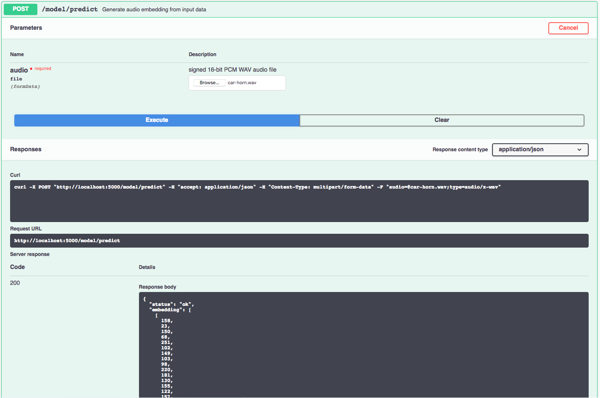

# Spotify Music Recommender


## About

Spotify create playlist recommendation everyday.The company has 70M users, 4M unique songs and 40 features. This means that they have apply O (70M x 4M x 40) = O(12 peta operations = 10 to the power of 15). This is really challenging!

Herein, spotify engineers implemented approximate nearest neighbor approach and published as an open source package: [annoy](https://github.com/spotify/annoy). Annoy comes with a huge speed but it does not guarantee to find the nearest one. It just approximates. It reduces the time complexity to O(log n).

## Annoy

Annoy ([Approximate Nearest Neighbors](http://en.wikipedia.org/wiki/Nearest_neighbor_search#Approximate_nearest_neighbor) Oh Yeah) is a C++ library with Python bindings to search for points in space that are close to a given query point. It also creates large read-only file-based data structures that are [mmapped](https://en.wikipedia.org/wiki/Mmap) into memory so that many processes may share the same data.

### Background

There are some other libraries to do nearest neighbor search. Annoy is almost as fast as the fastest libraries, (see below), but there is actually another feature that really sets Annoy apart: it has the ability to use static files as indexes. In particular, this means you can share index across processes. Annoy also decouples creating indexes from loading them, so you can pass around indexes as files and map them into memory quickly. Another nice thing of Annoy is that it tries to minimize memory footprint so the indexes are quite small.

Why is this useful? If you want to find nearest neighbors and you have many CPU's, you only need to build the index once. You can also pass around and distribute static files to use in production environment, in Hadoop jobs, etc. Any process will be able to load (mmap) the index into memory and will be able to do lookups immediately.

We use it at Spotify for music recommendations. After running matrix factorization algorithms, every user/item can be represented as a vector in f-dimensional space. This library helps us search for similar users/items. We have many millions of tracks in a high-dimensional space, so memory usage is a prime concern.

Annoy was built by [Erik Bernhardsson](http://www.erikbern.com/) in a couple of afternoons during [Hack Week](http://labs.spotify.com/2013/02/15/organizing-a-hack-week/).

### Summary of features

- Euclidean distance, Manhattan distance, cosine distance, Hamming distance, or Dot (Inner) Product distance
- Cosine distance is equivalent to Euclidean distance of normalized vectors = sqrt(2-2\*cos(u, v))
- Works better if you don't have too many dimensions (like <100) but seems to perform surprisingly well even up to 1,000 dimensions
- Small memory usage
- Lets you share memory between multiple processes
- Index creation is separate from lookup (in particular you can not add more items once the tree has been created)
- Build index on disk to enable indexing big datasets that won't fit into memory (contributed by [Rene Hollander](https://github.com/ReneHollander))

### Python API

- AnnoyIndex(f, metric) returns a new index that's read-write and stores vector of f dimensions. Metric can be "angular", "euclidean", "manhattan", "hamming", or "dot".
- a.add_item(i, v) adds item i (any nonnegative integer) with vector v. Note that it will allocate memory for max(i)+1 items.
- a.build(n_trees, n_jobs=-1) builds a forest of n_trees trees. More trees gives higher precision when querying. After calling build, no more items can be added. n_jobs specifies the number of threads used to build the trees. n_jobs=-1 uses all available CPU cores.
- a.save(fn, prefault=False) saves the index to disk and loads it (see next function). After saving, no more items can be added.
- a.load(fn, prefault=False) loads (mmaps) an index from disk. If prefault is set to True, it will pre-read the entire file into memory (using mmap with MAP_POPULATE). Default is False.

- a.get_nns_by_item(i, n, search_k=-1, include_distances=False) returns the n closest items. During the query it will inspect up to search_k nodes which defaults to n_trees \* n if not provided. search_k gives you a run-time tradeoff between better accuracy and speed. If you set include_distances to True, it will return a 2 element tuple with two lists in it: the second one containing all corresponding distances.

### How does it work

Using [random projections](http://en.wikipedia.org/wiki/Locality-sensitive_hashing#Random_projection) and by building up a tree. At every intermediate node in the tree, a random hyperplane is chosen, which divides the space into two subspaces. This hyperplane is chosen by sampling two points from the subset and taking the hyperplane equidistant from them.

We do this k times so that we get a forest of trees. k has to be tuned to your need, by looking at what tradeoff you have between precision and performance.

Hamming distance (contributed by [Martin Aumüller](https://github.com/maumueller)) packs the data into 64-bit integers under the hood and uses built-in bit count primitives so it could be quite fast. All splits are axis-aligned.

Dot Product distance (contributed by [Peter Sobot](https://github.com/psobot)) reduces the provided vectors from dot (or "inner-product") space to a more query-friendly cosine space using [a method by Bachrach et al., at Microsoft Research, published in 2014](https://www.microsoft.com/en-us/research/wp-content/uploads/2016/02/XboxInnerProduct.pdf).

## Dataset

128-dimensional audio features extracted at 1Hz. The audio features were extracted using a VGG-inspired acoustic model described in [Hershey et. al.](https://research.google.com/pubs/pub45611.html), trained on a preliminary version of [YouTube-8M](https://research.google.com/youtube8m/index.html). The features were PCA-ed and quantized to be compatible with the audio features provided with YouTube-8M. They are stored as TensorFlow Record files. The model used to generate the features is available in the [TensorFlow models GitHub repository](https://github.com/tensorflow/models/tree/master/research/audioset).

### Models for AudioSet: A Large Scale Dataset of Audio Events

This repository provides models and supporting code associated with [AudioSet](http://g.co/audioset), a dataset of over 2 million human-labeled 10-second YouTube video soundtracks, with labels taken from an ontology of more than 600 audio event classes.

AudioSet was [released](https://research.googleblog.com/2017/03/announcing-audioset-dataset-for-audio.html) in March 2017 by Google's Sound Understanding team to provide a common large-scale evaluation task for audio event detection as well as a starting point for a comprehensive vocabulary of sound events.

### Features dataset

Frame-level features are stored as [tensorflow.SequenceExample](https://github.com/tensorflow/tensorflow/blob/master/tensorflow/core/example/example.proto) protocol buffers. A tensorflow.SequenceExample proto is reproduced here in text format:

```json
context: {
  feature: {
    key  : "video_id"
    value: {
      bytes_list: {
        value: [YouTube video id string]
      }
    }
  }
  feature: {
    key  : "start_time_seconds"
    value: {
      float_list: {
        value: 6.0
      }
    }
  }
  feature: {
    key  : "end_time_seconds"
    value: {
      float_list: {
        value: 16.0
      }
    }
  }
  feature: {
    key  : "labels"
      value: {
        int64_list: {
          value: [1, 522, 11, 172] # The meaning of the labels can be found here.
        }
      }
    }
}
feature_lists: {
  feature_list: {
    key  : "audio_embedding"
    value: {
      feature: {
        bytes_list: {
          value: [128 8bit quantized features]
        }
      }
      feature: {
        bytes_list: {
          value: [128 8bit quantized features]
        }
      }
    }
    ... # Repeated for every second of the segment
  }

}
```

The total size of the features is 2.4 gigabytes. They are stored in 12,228 TensorFlow record files, sharded by the first two characters of the YouTube video ID, and packaged as a tar.gz file.

The labels are stored as integer indices. They are mapped to sound classes via [class_labels_indices.csv](http://storage.googleapis.com/us_audioset/youtube_corpus/v1/csv/class_labels_indices.csv). The first line defines the column names:

```csv
index,mid,display_name
```

Subsequent lines describe the mapping for each class. For example:

```csv
0,/m/09x0r,"Speech"
```

which means that “labels” with value 0 indicate segments labeled with “Speech”.

### How to Download

Download the audio dataset from [AudioSet](https://research.google.com/audioset/download.html). Scroll down to the section where it says "Manually download" and get the compressed `tar.gz` file. Double click to uncompress in your project repository. These are youtube videos that have been encoded using the [MAX-Audio-Embedding-Generator](https://github.com/IBM/MAX-Audio-Embedding-Generator).

## IBM Code Model Asset Exchange: Audio Embedding Generator

This repository contains code to instantiate and deploy an audio embedding model. This model recognizes a signed 16-bit
PCM wav file as an input, generates embeddings, applies
[PCA transformation/quantization](https://github.com/tensorflow/models/tree/master/research/audioset#output-embeddings),
and outputs the result as arrays of 1 second embeddings. The model was trained on
[AudioSet](https://research.google.com/audioset/). As described in the
[code](https://github.com/tensorflow/models/blob/master/research/audioset/vggish/vggish_inference_demo.py) this model is
intended to be used an example and perhaps as a stepping stone for more complex models. See the
[Usage](https://github.com/tensorflow/models/tree/master/research/audioset#usage) heading in the `tensorflow/models`
Github page for more ideas about potential usages.

The model files are hosted on IBM Cloud Object Storage. The code in this repository deploys the model as a web service
in a Docker container. This repository was developed as part of the
[IBM Code Model Asset Exchange](https://developer.ibm.com/code/exchanges/models/) and the public API is powered by [IBM Cloud](https://ibm.biz/Bdz2XM).

### Model Metadata

| Domain | Application | Industry | Framework  | Training Data   | Input Data Format                |
| ------ | ----------- | -------- | ---------- | --------------- | -------------------------------- |
| Audio  | Embeddings  | Multi    | TensorFlow | Google AudioSet | signed 16-bit PCM WAV audio file |

### Run Locally

1. [Build the Model](#1-build-the-model)
2. [Deploy the Model](#2-deploy-the-model)
3. [Use the Model](#3-use-the-model)
4. [Run the Notebook](#4-run-the-notebook)
5. [Development](#5-development)
6. [Cleanup](#6-cleanup)

#### 1. Build the Model

Clone this repository locally. In a terminal, run the following command:

```
$ git clone https://github.com/IBM/MAX-Audio-Embedding-Generator.git
```

Change directory into the repository base folder:

```
$ cd MAX-Audio-Embedding-Generator
```

To build the Docker image locally, run:

```
$ docker build -t max-audio-embedding-generator .
```

All required model assets will be downloaded during the build process. _Note_ that currently this Docker image is CPU
only (we will add support for GPU images later).

#### 2. Deploy the Model

To run the Docker image, which automatically starts the model serving API, run:

```
$ docker run -it -p 5000:5000 max-audio-embedding-generator
```

#### 3. Use the Model

The API server automatically generates an interactive Swagger documentation page. Go to `http://localhost:5000` to load
it. From there you can explore the API and also create test requests.

Use the `model/predict` endpoint to load a signed 16-bit PCM wav audio file (you can use the `car-horn.wav` file located
in the `samples` folder) and get embeddings from the API.



You can also test it on the command line, for example:

```
$ curl -F "audio=@samples/car-horn.wav" -XPOST http://localhost:5000/model/predict
```

You should see a JSON response like that below:

```
{
  "status": "ok",
  "embedding": [
    [
      158,
      23,
      150,
      ...
    ],
    ...,
    ...,
    [
      163,
      29,
      178,
      ...
    ]
  ]
}
```

#### 4. Run the Notebook

Once the model server is running, you can see how to use it by walking through [the demo notebook](samples/demo.ipynb).

<!-- _Note_ the demo requires `jupyter`, `numpy`, `sklearn` and `matplotlib`. -->

<!-- Run the following command from the model repo base folder, in a new terminal window (leaving the model server running in the other terminal window): -->

<!-- ```
jupyter notebook
``` -->

This will start the notebook server. You can open the demo notebook by clicking on `demo.ipynb`.

## Steps to Run

1. Download the data set audioset_v1_embeddings/, class_labels_indices.csv from the [AudioSet](https://research.google.com/audioset/download.html)

2. Pre-processing: Download the audio data set and convert it into json format by running all cells in `AudioSet_Processing.ipynb `

3. Training: Run the cells in `Spotify_Audio_Recommender.ipynb` to train the annoy recommender

4. Inference: Run the cell in `Spotify_Audio_Recommender.ipynb` for prediction

```
	nns_index = annoy_index.get_nns_by_item(193, 10)

```

## Next Steps

- Inference using an UI by uploading a audio file.

## Resources

[1] AudioSet Download: https://research.google.com/audioset/download.html

[2] MAX Audio Embedding Generator: https://github.com/IBM/MAX-Audio-Embedding-Generator

[3] Annoy slidedeck: https://www.slideshare.net/erikbern/approximate-nearest-neighbor-methods-and-vector-models-nyc-ml-meetup

[4] Annoy explained in more detail: https://www.youtube.com/watch?v=QkCCyLW0ehU

[5] Spotify Annoy: https://github.com/spotify/annoy

[6] Models for AudioSet: https://github.com/tensorflow/models/tree/master/research/audioset
